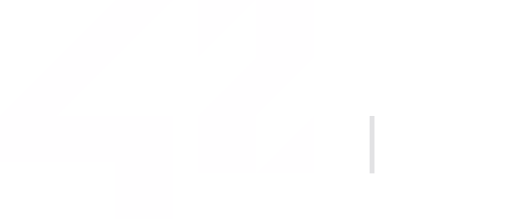

# 👋 Hi, I'm Wael Chatoui

🎯 **Computer Science student** from France, focused on building scalable and elegant solutions.  
💡 Passionate about **clean code**, **automation**, and **continuous 

---

## 🧩 Tech Stack

  

---

## 🚀 About Me

  

- 🎓 Studying **Computer Science** at **[42 School](https://42.fr/)**  
- 💻 Passionate about **Backend**, **DevOps**, and **Cloud Engineering**  
- 🧠 Always exploring **system design** and **performance optimization**  
- ⚙️ I work mainly with:
  - **TypeScript**, **React.js**, **Next.js**
  - **Node.js**, **Python**, **PostgreSQL**, **Supabase**
  - **Docker**, **Linux (Arch + KDE)**, **CI/CD pipelines**

---

## 🌐 Connect With Me

- 💼 [Portfolio Website](https://wael-chatoui.ovh)  
- 💬 [LinkedIn](https://www.linkedin.com/in/wael-chatoui-6275a1322)  
- 📫 [Mail](contact.fraawdrinn@gmail.com)

---

## 📊 GitHub Stats

  
  

---

⭐️ From [Wael Chatoui](https://github.com/wael-chatoui)
